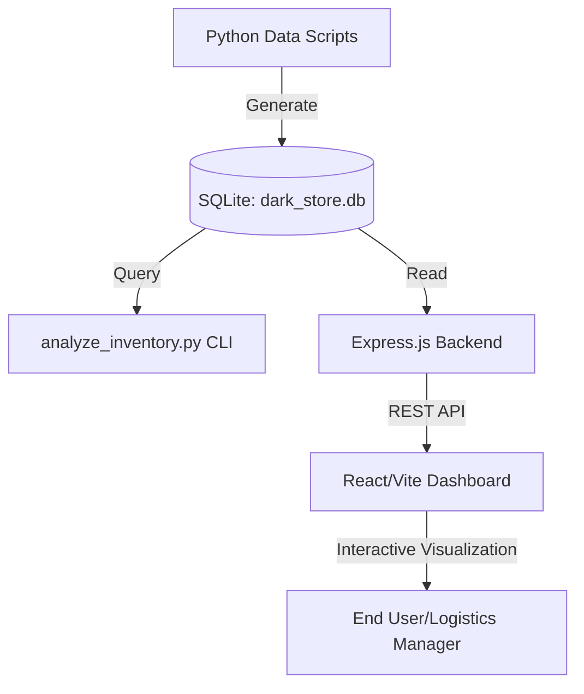

## Architecture Diagram



# Zepto Rohini Inventory Command Center


> Predictive stock-out detection for micro-warehouses using real-time demand velocity analysis and synthetic order simulation.

## 📖 Table of Contents
- [🚀 Overview](#-overview)
- [✨ Key Features](#-key-features)
- [🏗️ Architecture & Tech Stack](#-architecture--tech-stack)
- [📁 Directory Structure](#-directory-structure)
- [🛠️ Getting Started](#-getting-started)
- [🔌 API Reference / Usage](#-api-reference--usage)
- [🤝 Contributing](#-contributing)
- [📜 License](#-license)

## 🚀 Overview
The **Zepto Rohini Inventory Command Center** is a full-stack analytical platform designed to solve the 'Quick-Commerce Stock-Out Paradox.' In high-density urban areas like Rohini, demand spikes for specific categories (e.g., cold drinks during heatwaves or Maggi late at night) can deplete inventory faster than replenishment cycles. 

This system simulates a network of 15 dark stores, generates 100,000 randomized orders with weather and time-of-day logic, and uses advanced SQL analytics (Window Functions and Common Table Expressions) to identify items where current velocity significantly exceeds the 24-hour baseline. This allows logistics managers to trigger stock transfers before the shelf is empty.

## ✨ Key Features
- **Synthetic Order Engine**: Generates 100k records using `Faker` and custom logic to simulate realistic shopping patterns (e.g., higher delivery times during rain, late-night impulse buys).
- **Velocity Spike Detection**: A sophisticated SQL engine compares the last 24 hours of sales against the previous 24 hours to calculate a 'Spike Ratio.'
- **Geospatial Mapping**: Tracks specific micro-warehouses in the Rohini (Delhi) sector using randomized coordinates within the DTU (Delhi Technological University) perimeter.
- **Risk Ranking**: Automatically ranks items within categories based on stock-out risk, allowing managers to prioritize replenishment of high-impact items like Milk or Medicine.
- **Real-Time Dashboard**: A React-based interface that fetches live analytics from the SQLite database via an Express.js middleware.

## 🏗️ Architecture & Tech Stack
- **Data Layer**: SQLite serves as the edge-compatible database, storing store locations and order history.
- **Simulation Engine**: Python scripts handle the ETL (Extract, Transform, Load) and synthetic data generation using `numpy` and `pandas` for distribution logic.
- **Backend**: Node.js with Express provides a RESTful API layer, executing analytical SQL queries directly against the SQLite database.
- **Frontend**: A modern React application built with Vite, utilizing Hooks for state management and `CORS` for cross-origin data fetching.
- **Analytics**: Uses SQL Window Functions (`RANK() OVER`) and CTEs (`WITH` clauses) for complex time-series analysis without the overhead of an OLAP cube.

## 📁 Directory Structure
```text
.
├── backend/                 # Express.js server logic
│   └── server.js            # API endpoints & DB connection
├── frontend/                # React/Vite application
│   ├── src/                 # UI components and assets
│   └── vite.config.js       # Frontend build config
├── analyze_inventory.py     # CLI-based analytical tool
├── generate_data.py         # Store location generation script
├── generate_order.py        # 100k Order simulation script
├── requirements.txt         # Python dependencies
└── dark_store.db            # Local SQLite database (Generated)
```

## 🛠️ Getting Started

### Prerequisites
- **Node.js**: v18.x or higher
- **Python**: v3.9 or higher
- **SQLite3**: Installed locally

### Installation & Running Locally
1. **Clone and Setup Python Environment**:
   ```bash
   pip install -r requirements.txt
   ```

2. **Initialize the Database**:
   ```bash
   # Generate the 15 dark stores in Rohini
   python generate_data.py
   
   # Generate 100,000 synthetic orders (takes ~10 seconds)
   python generate_order.py
   ```

3. **Start the Backend**:
   ```bash
   cd backend
   npm install
   node server.js
   ```

4. **Start the Frontend**:
   ```bash
   cd ../frontend
   npm install
   npm run dev
   ```

## 🔌 API Reference / Usage

### Get Inventory Risks
Returns the top 15 items across all stores experiencing a demand spike greater than 1.5x baseline.

- **URL**: `/api/inventory-risks`
- **Method**: `GET`
- **Success Response**:
  - **Code**: 200
  - **Payload**:
    ```json
    [
      {
        "store_name": "Zepto_Rohini_sec_12",
        "item_name": "Ice Cream",
        "velocity_now": 45,
        "velocity_baseline": 12,
        "spike_ratio": 3.75,
        "risk_rank": 1
      }
    ]
    ```

## 🤝 Contributing
1. Fork the Project
2. Create your Feature Branch (`git checkout -b feature/AmazingFeature`)
3. Commit your Changes (`git commit -m 'Add some AmazingFeature'`)
4. Push to the Branch (`git push origin feature/AmazingFeature`)
5. Open a Pull Request

## 📜 License
Distributed under the MIT License. See `LICENSE` for more information.
